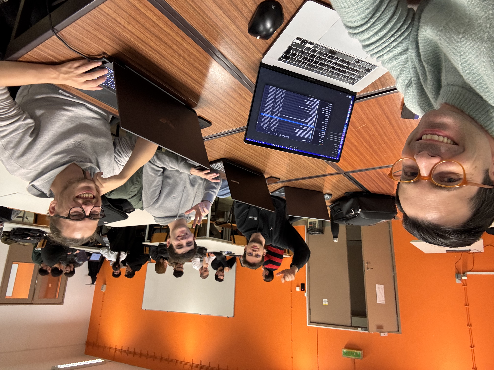

## Week 3 at a Glance

With the project scope defined in Week 2, this week was entirely about **building the literature foundation**. The team split the related work into nine subsections mirroring the article structure and spent Tuesday's session (10 March) cross-referencing papers and mapping each finding to a design decision.

## Windows Telemetry and Log Sources

The starting point for Module 1 is the data source. **Sysmon** and **Event Tracing for Windows (ETW)** are the dominant telemetry channels on Windows hosts, recording process creation, network connections, file and registry operations at fine granularity. A single host can generate millions of events per day, making filtering and feature engineering the first real bottleneck.

Key reference: **Kellect** (Chen et al., 2022) — a kernel-based ETW collector designed for minimal data loss, relevant for our pipeline's ingestion stage.

The **LMD-2023** dataset, built from real Sysmon logs with lateral movement attack scenarios, will serve as our primary benchmark.

## Classical ML for Log Anomaly Detection

We surveyed the main feature-based approaches:

- **Isolation Forest** (Liu et al.) — unsupervised one-class detector requiring no labeled attack data; widely used as a baseline in this space.
- **Extra Trees on Sysmon features** (Smiliotopoulos & Kambourakis, 2023) — AUC above 0.99 on lateral movement detection; a follow-up paper (2026 preprint) specifically studies the impact of class imbalance handling on reported results.
- **LOF + PCA** (Achmad et al., 2025) — F1 above 0.98 on malware classification from Sysmon events.
- **Explainable ETW classification** (Gwak et al., 2023) — highlights the critical gap between model outputs and analyst interpretability.

The shared limitation: **scores without semantic content**. An analyst receives a number, not an explanation of which behaviour was detected or which MITRE ATT&CK technique it corresponds to. This limitation is exactly what our Dual Sentinel module is designed to address.

## Sequence-Based Models and Autoencoders

Temporal ordering matters in log streams — the sequence of events often reveals attacks that individual event statistics miss:

- **LSTM/CNN-LSTM hybrids** — Ispahany et al. achieved F1 above 0.99 on incremental ransomware detection in Sysmon streams; their SILRAD system adds ADWIN-based drift detection.
- **GRU autoencoders** — trained on normal-only data, anomalies are detected through reconstruction error. Effective where temporal event structure is informative; the GRU autoencoder in our classical pipeline follows this one-class training paradigm.
- **Performance counter correlation** (Guo et al.) — 100% TPR at low FPR for ransomware over six-minute windows.

## Provenance Graphs

Graph-based approaches (ProGrapher, ORTHRUS) represent host activity as causal graphs and apply GNNs for anomaly detection. Strong results but poor reproducibility due to proprietary datasets. Operational cost of full provenance capture motivates our simpler log-window approach.

## LLMs for Cybersecurity

The most exciting territory. LLMs can process event sequences as text, produce natural-language descriptions, and directly map behaviour to **MITRE ATT&CK** technique identifiers — something statistical models fundamentally cannot do.

Key models evaluated for our Dual Sentinel pipeline:
- **Phi-3 Mini** (Microsoft, ~4B parameters) — compact SLM designed for efficient local inference on structured reasoning tasks. Will serve as the Analyst.
- **Llama 3.2** (Meta, ~8B parameters) — balanced size for edge deployment. Will serve as the Judge.
- Both run locally via **Ollama**, avoiding transmission of sensitive log content to external APIs — a hard requirement in security deployments.

The main risk: **hallucination**, where a model generates plausible but unsupported ATT&CK technique identifiers or misattributes behaviour. Preuveneers et al. and Alansari & Luqman provide a useful taxonomy of hallucination types and mitigations.

## LLM-as-a-Judge

The LLM-as-judge framework uses a second model to validate the output of a first, reducing reliance on human annotation at inference time:

- **G-Eval** — explicit scoring rubrics bring GPT-4 judgements close to human agreement.
- **MT-Bench / Chatbot Arena** (Zheng et al.) — benchmarked judge reliability across model pairs.
- Known failure modes: positional bias and verbosity bias (Gu et al. survey).

In our architecture, **Phi-3 produces an initial verdict** and **Llama 3.2 evaluates that verdict against observed evidence** before issuing the final result. This cross-validation is expected to catch both hallucinated claims and prompt injection payloads — OWASP classifies prompt injection as the primary vulnerability for LLM-integrated applications.

## Deep Face Recognition

For Module 2, the survey covers the standard recognition pipeline:

- **MTCNN** (Zhang et al.) — multi-task cascaded detection and landmark localisation for consistent geometric alignment. Will be used in our closed-set training pipeline.
- **ArcFace** — the angular margin loss function that is now the standard training objective for discriminative face embeddings. Our closed-set models (FaceCNN and ResNet-50) will use it.
- **InsightFace / RetinaFace** — robust and CPU-efficient detector; the buffalo\_sc model will power our open-set real-time pipeline.
- **ResNet-50** — backbone configuration producing 512-dimensional embeddings.

## Open-Set Recognition and Anti-Spoofing

Scheirer et al. formalised the open-set recognition problem, showing that closed-set classifiers systematically overestimate confidence on unknown inputs — motivating our embedding-based cosine similarity approach. Anti-spoofing (presentation attacks) remains an open problem; we acknowledge this as a limitation of the current system.

## Next Steps

- Integrate all survey notes into the article's Related Work section.
- Begin the System Architecture section: classical pipeline, Dual Sentinel, face recognition.
- Define the experimental setup: train/test splits, evaluation metrics (F1, FPR, explanation quality for LLM output).

---

*Nine subsections of related work, all mapped to concrete design decisions. The article is taking shape.*
