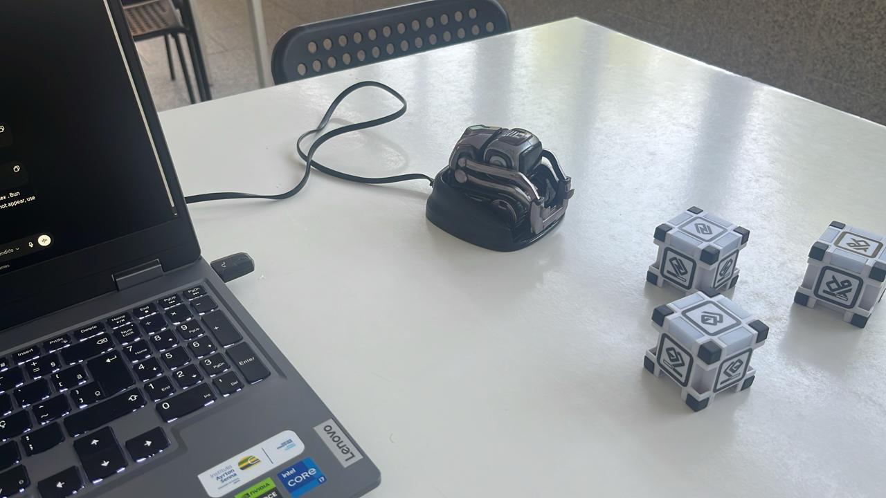

## Week 2 Overview

Week 2 was mainly research-oriented. Before developing new functionality, we needed a stronger state-of-the-art baseline for the final proposal.

The work is being organized around four connected research areas:

1. Cyber threat detection with interpretable AI.
2. Open-set face recognition for access control.
3. Autonomous navigation and patrol behavior.
4. Multi-agent systems for coordination and response.

Each area has existing solutions, but the most relevant contribution of our project is the **integration framework** between them.

## Cybersecurity Baseline

The cybersecurity component builds on **Dual Sentinel**. Instead of producing only anomaly scores, the system generates human-readable assessments and maps suspicious behavior to MITRE ATT&CK techniques.

This is important because security teams need explanations they can inspect. A useful alert should describe what happened, why it matters and which evidence supports the conclusion.

The baseline includes:

- Windows endpoint telemetry.
- MITRE ATT&CK technique mapping.
- LLM-based analysis with a judge component.
- Local execution with Ollama models such as Phi-3 and Llama 3.2.

## Physical Security Baseline

For the physical security side, the project uses an open-set recognition approach. The system compares face embeddings with authorized identities and rejects unknown individuals when similarity is below the accepted threshold.

This matters because a real security system cannot assume that every person detected by the camera belongs to a known class. Unknown identities must be handled explicitly.

## Robotics Baseline

The robotics layer is expected to provide autonomous movement through a controlled environment. For now, the focus is simulation:

- **ROS 2** for the robotics middleware.
- **Nav2** for navigation and path planning.
- **Webots** for testing patrol behavior in a repeatable environment.
- **YOLOv8** for object detection and scene awareness.

## Robot Connection Tests - 21 May

On 21 May, we also moved from literature review into a first practical contact with the robotic platform. The objective was to test the connection to small mobile robots and understand how they could later support the face recognition component.

This session helped us clarify several implementation details:

- How the robot can be connected and controlled during local tests.
- How camera-based perception could be integrated into the physical security workflow.
- What constraints appear when moving from a computer-only face recognition prototype to a robot-assisted scenario.
- How the robot could eventually approach or observe a target area when identity verification is required.

Although this was still an exploratory test, it was important for validating the feasibility of the cyber-physical direction. The project depends on more than detecting faces in isolation; the recognition module must make sense in a mobile surveillance context.

## Multi-Agent Coordination

We also started defining the decision layer as a **BDI multi-agent system** using SPADE and FIPA-ACL communication.

The planned agents are:

| Agent | Responsibility |
|---|---|
| Perception Agent | Collect sensor and cybersecurity telemetry. |
| Cyber Sentinel Agent | Evaluate cyber threat intelligence. |
| Physical Sentinel Agent | Manage identity verification and access decisions. |
| Navigation Agent | Execute patrol and movement actions. |
| Coordinator Agent | Correlate events and define response strategy. |
| Operator Agent | Produce reports for human security operators. |

## Next Steps

The next week will focus on converting this research baseline into the first complete structure of the state-of-the-art document and on refining the scenario used to demonstrate why cyber and physical correlation matters.

---

*The main lesson from this week: the technology exists, but the coordination problem is where the project becomes interesting.*
